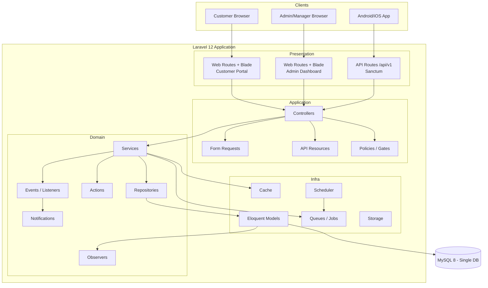
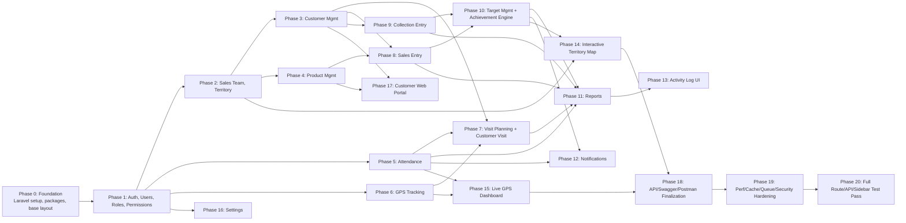
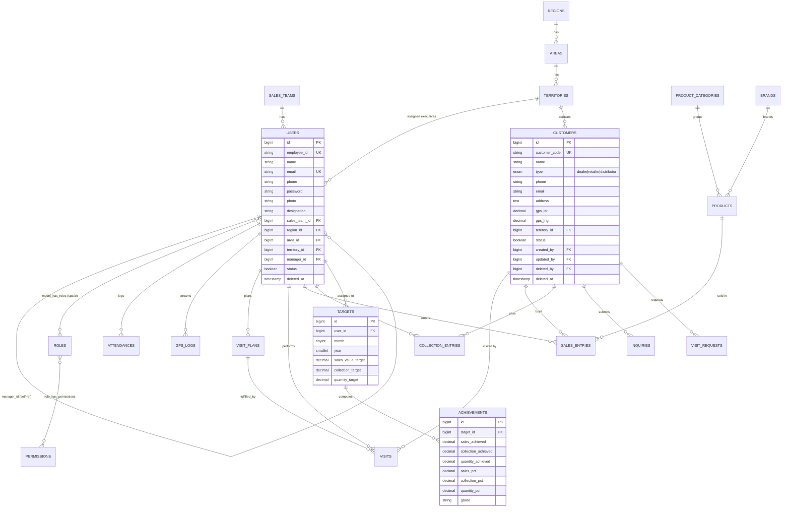

# Gazi Pump SFA — System Architecture & Implementation Plan

## Context

The working directory (`E:\xampp8.2\htdocs\gazi_pump`) is empty — this is a greenfield build. The user has specified a large enterprise Sales Force Automation system (3 sub-systems: Customer Portal, Admin/Sales Dashboard, Mobile REST API) sharing one MySQL database, built on Laravel 12 / PHP 8.2, with strict rules: **no whole-project generation, module-by-module delivery only, each module stopped for approval before the next begins**, and every module must ship with the full vertical slice (migration → model → factory → seeder → policy → form request → repository → service → web controller → API controller → routes → views → JS/CSS → tests → docs).

This plan is the required Phase 0 deliverable: architecture, ERD, folder structure, UI sitemap, roadmap, and standards — **before any code is written**. Environment check confirms PHP 8.2.12, Composer 2.7.9, Node 16.16 are installed under XAMPP. Node 16 is below what Vite 5/Laravel 12's default frontend tooling expects (Node ≥18) — flagged as a setup risk to resolve in Phase 0 (either upgrade Node or pin Vite/plugin versions compatible with Node 16).

No exploration agents were used — there is no existing codebase to survey.

---

## 1. System Architecture

Three presentation layers, one Laravel 12 application, one MySQL database, shared domain layer (Models/Repositories/Services/Policies/Events).



**Layering rule (enforced every module):** Controller → Service (business rules, transactions) → Repository (Eloquent query encapsulation, interface-bound for testability) → Model. Controllers never touch Eloquent directly. Form Requests own validation; Policies own authorization; API Resources own output shaping; Observers own audit columns (`created_by/updated_by/deleted_by`) + Spatie Activity Log hooks.

### Cross-cutting concerns wired once, reused everywhere
- **Auth**: session guard (`web`) for Admin + Customer Portal (separate `customer` guard), Sanctum token guard for API.
- **Authorization**: Spatie Permission — menu/submenu/button/API/report permissions, enforced via Policies + Blade `@can` + route middleware.
- **Audit**: `BlameableObserver` trait/trait-based Observer sets created_by/updated_by/deleted_by on every model; Spatie Activitylog logs all writes.
- **Soft deletes**: universal `SoftDeletes` trait + reusable `HasAudit` trait combined in a base `Model` (`app/Models/BaseModel.php`).
- **Standard API envelope**: a `ApiResponse` helper/trait producing `{success, message, data, meta}` consistently, with a central exception handler mapping validation/model-not-found/auth errors to that envelope.

---

## 2. Module Dependency Diagram



Rationale for order: everything needs Auth/RBAC first. Org hierarchy (Sales Team, Territory — Region/Area tiers were removed post-launch as unneeded overhead) is required before Customer, Attendance, GPS, Targets can reference it. Visit/Sales/Collection depend on Customer (+Product for Sales). Target/Achievement depends on Sales+Collection data existing. Reports/Map/Live-GPS/Notifications are read-layers over the above, so built last among "business" modules. Customer Portal is deliberately late — it only needs Product + Customer(dealer locator) + a customer-specific auth guard, and is functionally independent of the sales-ops modules.

---

## 3. Database ERD (core entities)



Additional supporting tables (customer portal + system tables, not diagrammed for brevity): `news`, `promotions`, `faqs`, `service_centers`, `brochures`, `regions`, `areas`, `sales_teams`, `notifications` (Laravel default), `activity_log` (Spatie default), `personal_access_tokens` (Sanctum), `permissions`/`roles`/`model_has_permissions`/`model_has_roles`/`role_has_permissions` (Spatie default).

**Conventions:** `bigint unsigned` auto-increment PKs; every business table gets `created_by/updated_by/deleted_by` (nullable FK → users, `nullOnDelete`), `deleted_at` (soft delete), `status` boolean where applicable, indexes on every FK + on `(territory_id)`, `(user_id, month, year)` for targets, `(user_id, recorded_at)` for gps_logs, composite unique on `(employee_id)`, `(customer_code)`, `(sku)`.

---

## 4. Folder Structure

```
app/
    Actions/                  # single-purpose invokable business actions (e.g. CalculateAchievementAction)
    DTO/                      # data transfer objects for cross-layer payloads
    Enums/                    # UserRole, VisitStatus, PaymentMethod, TargetType, CustomerType, PerformanceGrade...
    Events/                   # AttendanceMarked, VisitCompleted, TargetAchieved, GpsPinged...
    Helpers/                  # ApiResponse, DistanceCalculator, GeoHelper
    Http/
        Controllers/
            Web/Admin/...
            Web/Portal/...
            Api/V1/...
        Requests/
            Admin/...
            Api/V1/...
        Middleware/
        Resources/            # API Resources per entity
    Jobs/                     # ExportExcelJob, GenerateReportPdfJob, RecalculateAchievementsJob
    Listeners/
    Models/
        BaseModel.php         # SoftDeletes + HasAudit + LogsActivity composed
    Notifications/
    Observers/
    Policies/
    Repositories/
        Contracts/            # interfaces, bound in RepositoryServiceProvider
        Eloquent/
    Services/
    Traits/                   # HasAudit, HasStatusToggle, Exportable, Importable
resources/
    views/
        layouts/              # admin, portal, auth
        components/           # shared Blade components (data-table, modal, filter-bar, stat-card)
        dashboard/
        users/ teams/ territories/ customers/ products/
        attendance/ gps/ visits/ sales/ collections/
        targets/ reports/ settings/ notifications/ activity-log/
        portal/               # customer-facing pages
    js/
    css/
public/
    assets/{css,js,images,icons}
database/
    migrations/ factories/ seeders/
routes/
    web.php                   # admin dashboard
    portal.php                # customer portal
    api.php  -> api/v1.php
tests/
    Unit/ Feature/ Api/
docs/
    architecture/  erd/  api/ (openapi.yaml)  postman/
```

Repository interfaces + `RepositoryServiceProvider` binding are introduced in Phase 0 so every later module follows the same contract-first pattern.

---

## 5. UI Sitemap

**Admin/Sales Dashboard** (role-gated menu, Spatie permissions control visibility):
Dashboard → Users → Roles & Permissions → Sales Teams → Territories → Customers → Product Categories/Brands/Products → Attendance → GPS Tracking (Live + History) → Visit Planning → Customer Visits → Sales Entry → Collection Entry → Targets → Achievements → Reports (submenu per report type) → Territory Map → Notifications → Activity Log → Settings.

**Customer Web Portal**: Home → About → Products (Catalog → Category → Details) → Dealer Locator → News → Promotions → FAQ → Service Center → Warranty Info → Brochures → Contact Us → [Auth] Register/Login → Customer Dashboard (Profile, My Inquiries, My Visit Requests).

**Mobile API** mirrors dashboard business modules under `/api/v1/*` (no admin-only screens like Settings/Roles UI, but role/permission checks still apply for manager-level API reads).

---

## 6. Development Roadmap (module delivery order — one approval gate between each)

| # | Module | Key deliverables |
|---|--------|-------------------|
| 0 | **Foundation** | Laravel 12 install, `.env`/MySQL config, Composer packages (Sanctum, Spatie Permission, Spatie Activitylog, Laravel Excel, DomPDF, L5-Swagger), base layouts (admin/portal), `BaseModel`, `HasAudit` trait, `ApiResponse` helper, exception handler envelope, `RepositoryServiceProvider`, Vite/Bootstrap 5.3 scaffold, base Blade components (data table, modal, filter bar) |
| 1 | **Auth, Users, Roles & Permissions** | Sanctum auth, admin login, Users CRUD, Spatie roles/permissions incl. menu/submenu/button/API/report permission types, Policies, seeders for hierarchy + 600 demo users |
| 2 | **Org Structure** | Sales Team, Territory CRUD (+ polygon GeoJSON field on Territory) — Region/Area tiers removed post-launch |
| 3 | **Customer Management** | Customer CRUD, Excel import/export, GPS field, dealer/retailer/distributor types |
| 4 | **Product Management** | Category, Brand, Product CRUD, import/export |
| 5 | **Attendance** | Check-in/out, GPS+photo capture, late detection, report |
| 6 | **GPS Tracking** | gps_logs ingestion API, location/travel history, distance calc |
| 7 | **Visit Management** | Visit Plan + Customer Visit (check-in/out, GPS verification, photo, feedback) |
| 8 | **Sales Entry** | Manual sales entry CRUD |
| 9 | **Collection Entry** | Manual collection entry CRUD |
| 10 | **Target & Achievement Engine** | Target CRUD by managers, auto achievement % + grade calculation (queued job) |
| 11 | **Reports** | All listed reports, Excel/PDF export, print views |
| 12 | **Notifications** | Late attendance, no checkout, low performance, target reminder, birthday, announcements |
| 13 | **Activity Log** | Spatie activity UI/filters (logging itself wired since Phase 0 via observers) |
| 14 | **Interactive Territory Map** | Leaflet + OSM GIS dashboard with color-coded achievement |
| 15 | **Live GPS Dashboard** | Real-time marker map with filters |
| 16 | **Settings** | System/company/app settings |
| 17 | **Customer Web Portal** | Public site + customer auth/dashboard/inquiries/visit requests |
| 18 | **API/Docs Finalization** | OpenAPI/Swagger complete spec, full Postman collection w/ environments |
| 19 | **Hardening** | Caching, indexes review, queue/scheduler wiring, security review (CSRF/XSS/SQLi/rate limits) |
| 20 | **Full Verification Pass** | Walk every sidebar menu, every web route, every API route (via Postman) end-to-end |

Each module row above, when built, ships the full 23-file checklist from the spec (migration → ... → Postman update) scoped to that module's entities only.

---

## 7. Coding Standards (applied uniformly)

- PSR-12 formatting; strict types (`declare(strict_types=1)`) in all PHP files.
- SOLID: interfaces for repositories (`Contracts\*RepositoryInterface`), services depend on interfaces not concretions, single-responsibility Actions for isolated business rules (e.g. achievement calculation), Enums (native PHP 8.2 backed enums) instead of magic strings.
- Repository-Service pattern strictly: no Eloquent calls in Controllers or Blade.
- Form Requests for all validation; API Resources for all API output; Policies for all authorization checks (`$this->authorize(...)` in every controller action).
- DRY UI: shared Blade components for data tables (DataTables.net wired), filter bars, modals, stat cards — built once in Phase 0, reused by every module.
- Every list page: search, advanced filter, sort, pagination (server-side), soft delete + restore + permanent delete (Super Admin only), bulk delete/restore, Excel import/export (Laravel Excel), PDF export/print (DomPDF), status toggle, audit columns displayed.
- Every destructive action requires a SweetAlert2 confirmation dialog client-side AND server-side policy check.
- Tests: Feature test per CRUD (list/create/update/delete/restore), API test per endpoint (auth + validation + happy path), Unit test per Service/Action with non-trivial logic (achievement %, distance calc, late detection).

---

## 8. Immediate Next Step (Module 0 — pending this plan's approval)

Once approved, the next turn scaffolds Module 0 (Foundation) only: fresh Laravel 12 project in this directory, `.env` wired to a local MySQL DB (proposed name `gazi_pump_sfa`, `root`/no-password per standard XAMPP default — will confirm/adjust if your MySQL differs), required Composer packages, base layouts/components, `BaseModel`/`HasAudit`/`ApiResponse`/repository-binding scaffolding, and Bootstrap 5.3 + Vite frontend build (flagging the Node 16 vs Vite version constraint to resolve at that point). No business-domain code (Users/Roles/etc.) is written until Module 0 is approved, matching the module-by-module rule.
